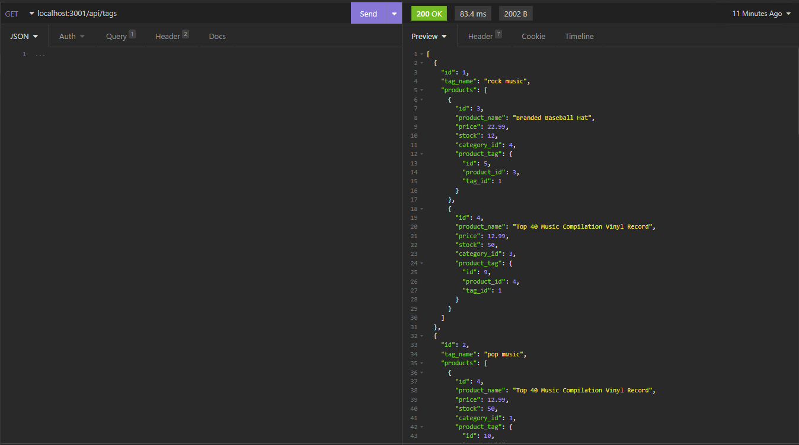

# E-Commerce Backend Development
[](https://opensource.org/licenses/MIT)

## Project Description
This is a backend application that provides routes, models, and seed data for an e-commerce website. Using Insomnia, I was able to verify that the routes are routing and populating correctly. Express.js, MySQL, and Sequelize were utilized in this project for backend development.

## User Story
```
AS A manager at an internet retail company
I WANT a back end for my e-commerce website that uses the latest technologies
SO THAT my company can compete with other e-commerce companies```

## Acceptance Criteria
```
GIVEN a functional Express.js API
WHEN I add my database name, MySQL username, and MySQL password to an environment variable file
THEN I am able to connect to a database using Sequelize
WHEN I enter schema and seed commands
THEN a development database is created and is seeded with test data
WHEN I enter the command to invoke the application
THEN my server is started and the Sequelize models are synced to the MySQL database
WHEN I open API GET routes in Insomnia for categories, products, or tags
THEN the data for each of these routes is displayed in a formatted JSON
WHEN I test API POST, PUT, and DELETE routes in Insomnia
THEN I am able to successfully create, update, and delete data in my database
```

## Installation
Once the repository is downloaded, you will want to ensure that these folders are already present:
```
.
├── config/             
│   └── connection.js
├── db/                  // initializes the database    
│   └── schema.sql
├── models/                   // models for each route
│   ├── Category.js
│   ├── index.js
│   ├── Product.js
│   ├── ProductTag.js
│   └── Tag.js
├── routes/ 
|   ├── api/                //routes to the models' data
|   |   ├── category-routes.js
|   |   ├── index.js
|   |   ├── product-routes.js
|   |   └── tag-routes.js      
|   └── index.js
├── .gitignore             // indicates which folders and files Git should ignore
├── seeds/                 // seeds the data into the models
|   ├── category-seeds.js
|   ├── index.js
|   ├── product-seeds.js
|   ├── product-tag-seeds.js
|   └── tag-seeds.js         
├── package.json
└── server.js               // runs the application
```    
You will need node.js on your computer to run this application, as well as all of the dependencies in the package. Run `npm init` and `npm i` in the terminal to initialize and install the packages.

## Usage
You can run the application by typing `node run seed` and `npm run start` into the terminal.

Once the server is started, the data can be populated by entering the routes.

[Video Preview](https://drive.google.com/file/d/1p5oCut8M39d6_ggzA8ji8PX8EEuRkS0j/view)

## License

This project is licensed under the terms of the MIT license.
[MIT License](https://opensource.org/licenses/MIT)